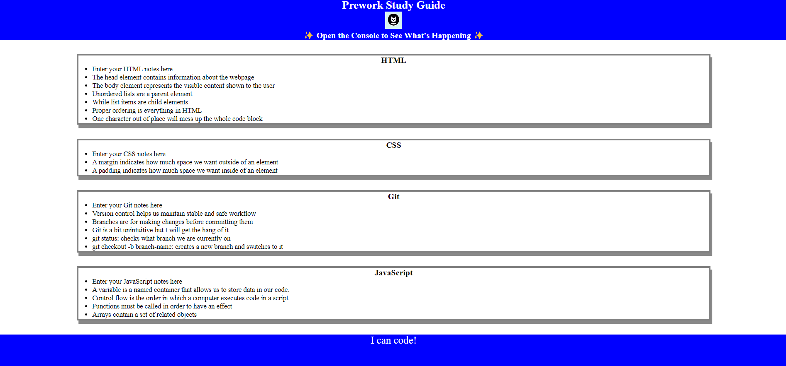

# <John's-Study-Guide>

## Description

I have put together, both for my own personal and professional development and as a show of my willingness to learn, a study guide that expresses what I have learned both through its content and very form itself.

- I was motivated to create this project because of the highly instructive manner in which its actual creation could help me attain the boilerplate skills needed to become adept at coding.
- I created this project as a proof-of-concept to demonstrate that I was able to obtain these capabilities.
- The project serves as both a declaration of modest achievment and as a tool I can use to catalogue information that I find useful throughout my studies.
- Over the course of developing this project, I learned how to structure a web page with HTML, comprehensively design its elements fluidly with CSS, implement dynamic elements with JavaScript, and maintain a safe and secure workflow by using Git.

## Table of Contents

- [Installation](#installation)
- [Usage](#usage)
- [Credits](#credits)
- [License](#license)

## Installation

This project can be freely loaded into any modern web browser software.

## Usage

This project may be used as a simple reference material for critical information, but may also be used as a testing ground for the implementation of new ideas and concepts as I move forward as a developer.

## Credits

This was created by John Paul Zigterman using the tools provided by the Michigan State University Coding Bootcamp.

## License

MIT License

Copyright (c) [year] [fullname]

Permission is hereby granted, free of charge, to any person obtaining a copy
of this software and associated documentation files (the "Software"), to deal
in the Software without restriction, including without limitation the rights
to use, copy, modify, merge, publish, distribute, sublicense, and/or sell
copies of the Software, and to permit persons to whom the Software is
furnished to do so, subject to the following conditions:

The above copyright notice and this permission notice shall be included in all
copies or substantial portions of the Software.

THE SOFTWARE IS PROVIDED "AS IS", WITHOUT WARRANTY OF ANY KIND, EXPRESS OR
IMPLIED, INCLUDING BUT NOT LIMITED TO THE WARRANTIES OF MERCHANTABILITY,
FITNESS FOR A PARTICULAR PURPOSE AND NONINFRINGEMENT. IN NO EVENT SHALL THE
AUTHORS OR COPYRIGHT HOLDERS BE LIABLE FOR ANY CLAIM, DAMAGES OR OTHER
LIABILITY, WHETHER IN AN ACTION OF CONTRACT, TORT OR OTHERWISE, ARISING FROM,
OUT OF OR IN CONNECTION WITH THE SOFTWARE OR THE USE OR OTHER DEALINGS IN THE
SOFTWARE.